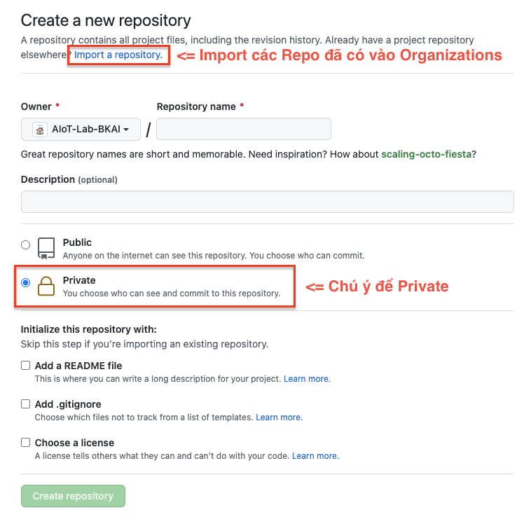

# Hướng dẫn thông tin sử dụng AIoT Lab Organization
* **Chú ý:** các bạn chuyển các Repo source-code hiện tại từ Github cá nhân sang Github của Lab nhé (hướng dẫn ở bên dưới)!

## 1. Quy định chung 
- Đọc kỹ thông tin hướng dẫn bên dưới để đảm bảo thống nhất chung cho toàn bộ các Repo trên Github của nhóm.
- Chỉ thành viên trong Team mới có các quyền xem / sửa / xóa các Project trong Team đó.

## 2. Tạo và quản lý Repo mới
- **Lưu ý:** tạo Repo và phân quyền hợp lý.

---
### 2.1. Quy định đặt tên Repo
* Đối với Project cá nhân:

```
[Tên người phụ trách]-[Tên nhóm]-[Tên Project]
```
Ví dụ: `ThanhNT-MEC-Fuzzy-Q-learning-based-for-OCMA`

* Đối với Project theo nhóm:

```
[Tên nhóm]-[Tên Project]
```
Ví dụ: `MEC-Fuzzy-Q-learning-based-for-OCMA`

---
### 2.2. Tạo Repo 

- Tại phần trang chủ của `AIoT Lab` chọn `New`


- Tạo Repo:
	- Nếu đã có từ Github cá nhân chọn `Import a repository`.
	- Nếu tạo Repo mới thì chỉ cần điền thông tin bên dưới (theo các quy định đặt tên như hướng dẫn trên)

- **Chú ý:** để Repo ở chế độ Private.



---
### 2.3. Quản lý quyền trong Repo
- Lựa chọn Repo cần sửa:
	- Bước 1. Truy cập vào phần `Settings`
	- Bước 2. Lựa chọn `Manager access`
	- Bước 3. Lựa chọn `Invite teams or people`
	- Bước 4. Chỉnh sửa quyền của `teams/people`


## 3. Tạo và thêm thành viên vào Team 

- **Lưu ý:** không lạm dụng việc tạo quá nhiều Team. Chỉ tạo Team khi cần thiết và Team phải được đặt tên hợp lý.

---
### 3.1. Hướng dẫn tạo Team
- Bước 1. Truy cập `Teams`
- Bước 2. Lựa chọn `New Teams` 
- Bước 3. Điền các thông tin và lựa chọn Team gốc nếu có


---
### 3.2. Thêm thành viên vào Team 
**Lưu ý:** Nếu bạn là người tạo ra Team sẽ có quyền cao nhất với Team đó.

- Bước 1. Lựa chọn Team cần thêm thành viên
- Bước 2. Lựa chọn `Members` phía Header-Menu 
- Bước 3. Ấn `Add a member`


---
### 3.3. Xin tham gia vào Team 
**Lưu ý:** Nếu bạn là người không tạo ra Team đó và muốn tham gia.

- Bước 1. Lựa chọn Team cần thêm thành viên
- Bước 2. Lựa chọn `Members` phía Header-Menu 
- Bước 3. Ấn `Add a member`


